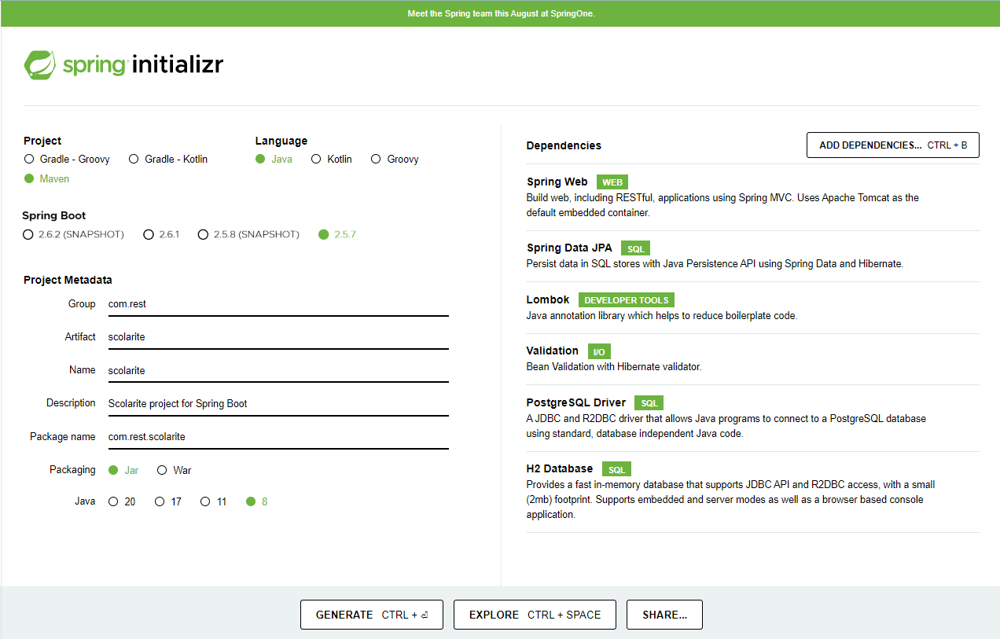

[Version française](README.md)

# Spring Boot Rest Api - School Management

In this tutorial, we will create a Spring Boot Rest API for a school management application in the following terms:

##### Structure of database based on the following business demands:
School management that contains sthis structure:
* Students are related to one class only
* Only one teacher per class
* The student should contain the following information: ID, First Name, Last Name
* The teacher should contain the following information: ID, First Name, Last Name
* The class should contain the following information: ID, name

##### RESTful API using Java Spring Boot with the following:
* Secure API after login using JWT generated token.
* Get the list of students with the following:
* Filters: Class Name and/or Teacher Full Name
    - All Students list will be returned in case of no filters value
* Paginated

##### Spring Boot
Spring Boot is a Spring project that make the process of setting up and publishing applications easy.

By following simple steps, you will be able to execute your first project.

##### API REST (Representational State Transfer Application Program Interface)
It is based on the **HTTP** protocol to transfer information.
A client launches an HTTP request, and the server returns a response through several methods, the most used of which are: **POST**, **GET**, **PUT** and **DELETE**.

##### Used tools : 
* Java 8
* IDE Intellij IDEA
* Spring Boot 2.5.7 (with Spring Web MVC and Spring Data JPA)
* PostgreSQL
* Lombok 1.18.22
* Maven 4.0.0

## Project initialization
To bootstrap a Spring Boot application, we can start the project from scratch with our favorite IDE, or just use another way that makes life easier: [SpringInitializr](https://start.spring.io/)

Initially, we chose the following dependencies: Spring web, Spring Data JPA, Validation, H2 Database, Lombok and PostgreSQL Driver.

## Steps to run the project

* Create the database by referring to the creation parameters in the application.properties file under resources.
* Run your project by clicking on (Run 'ScolariteApplication') or by using the shortcut (Shift+F10)
* Run the script in the insertion.sql file under resources/sqlschemas to populate the database with test data.
* Run postman and import the file scolarite App.postman_collection.json under resources/postman:
    - Create a new user using the request register '{{url}}/api/register'
    - Authenticate and take a token using the request '{{url}}/api/authenticate'
    - Display the list of students according to filters entered in the request '{{url}}/api/etudiants/search?nomClasse=Classe1&nomEnseignant=Sofien Zaghdoudi&page=1&per_page=2'